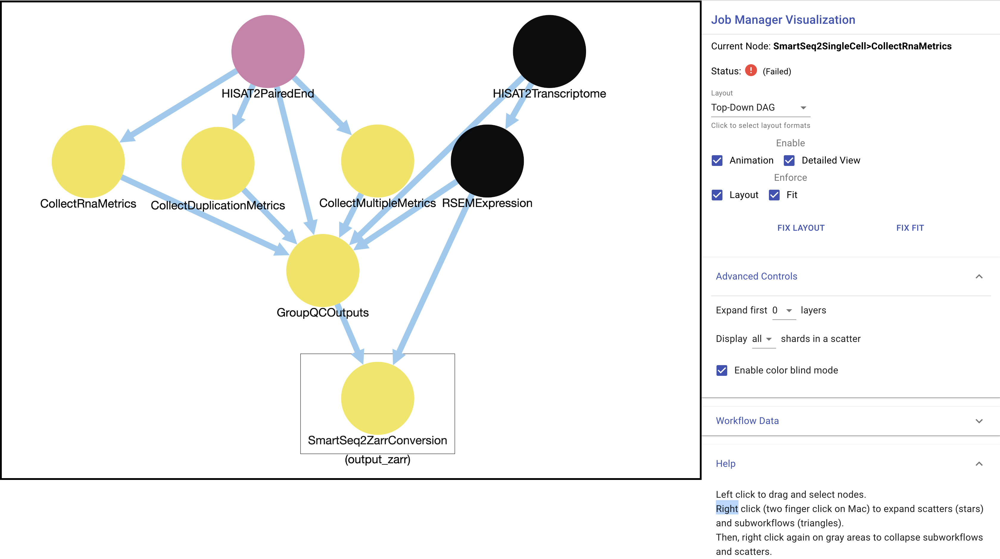
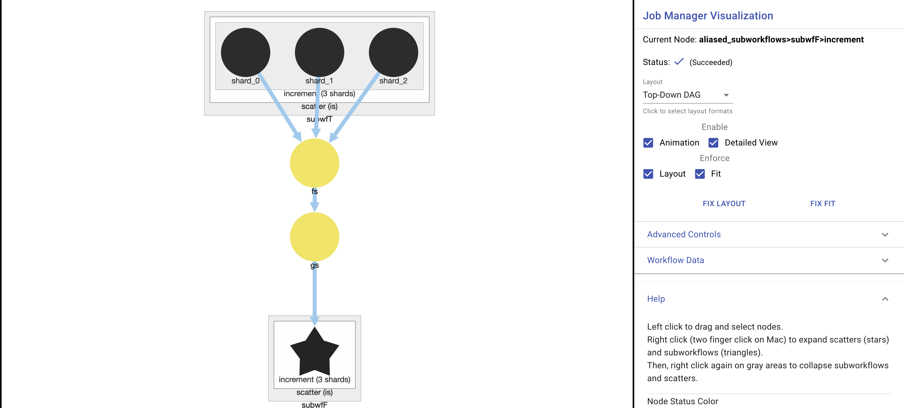
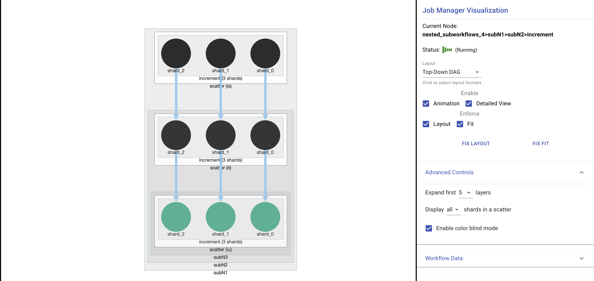
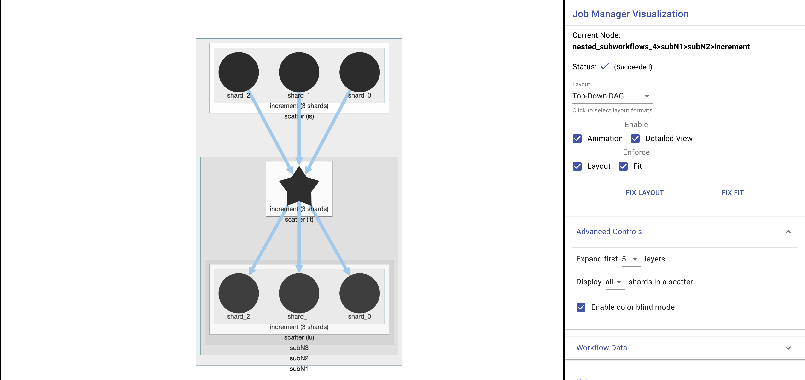

# Workflow Visualizer



---

This project helps visualize the progress of computational workflows on the Cromwell engine. Using a directed graph UI, a user will be able to see the status of individual calls and tasks of a workflow as well as see data generated from the workflow.

Once workflow manager is rewritten in react, this project will be able to be integrated into workflow manager project.

### How to use workflow visualizer component

To use the workflow visualizer, you just need to import WorkflowVisualizer.js as a component.

For example,

```javascript
import WorkflowVisualizer as './WorkflowVisualizer'
```

Then give the component a props that specifies the current workflow id.

For example,

```javascript
<WorkflowVisualizer workflowId={this.state.workflowId} />
```

### Current Problems

1. There is currently no API endpoint to convert WDL files to DOT files. So, right now we are manually pre-converting WDL to DOT via Womtool. For this to work smoothly, it is necessary to have an endpoint that workflow visualizer can hit based on the workflow id to fetch the corresponding dot files.
2. The way that we locate subworkflows will not always work. Currently, in GraphManipulator.js, we find the alias name associated with a subworkflow. Then, it fetches a subworkflow with its manually pre-computed dot file derived from its wdl file. This problem is hard to solve without the proper endpoints created, because depending on how the subworkflow file fetching is implemented, it will change how GraphManipulator.js will operate when parsing for subworkflow names.
3. Womtool needs modification to add an additional field. I've pushed this as a branch onto the cromwell repo.

### How Workflow Visualizer Works.

We are using CytoscapeJS and its react component to build the graph. Workflow visualizer is able to handle most cases of subworkflows, scatters, and if statements.

#### High level overview:

A dot file is inputted and its nodes are generated. Then, Cromwell metadata is integrated into the graph via an api call and some processing is used to get the metadata into an easily readable format. Then, all scatters and subworkflow nodes have listeners attached to them such that right clicks (or two finger clicks on mac) causes an expansion of the nodes. Finally, there is a sidebar in the WorkflowVisualizer component that gives additional controls to the user.

##### Subworkflows

Subworkflows work as follows: you first look for the data associated with the subworkflow node that you intend to expand. Then, you identify the subworkflow name and then find the corresponding DOT file. The dot file is parsed and the subworkflow nodes are inputted onto the graph but these nodes still need to integrate the metadata information. Then, all the statuses of the nodes are updated in the graph based on the metadata. This means that the color of the nodes have changed to reflect ongoing status of the nodes as well as identifying which nodes are scatters and subworkflows. Finally, the edges of parent nodes are redistributed to parents.

##### Scatters

Scatters work as follows: first you parse the metadata, then you look for data associated with the scatter node. Then, you create each shard as described by the metadata and add it as children to the scatter node. Finally, you distribute the scatter node edges to the respective shards.

##### If statements

If statements work as follows: unlike subworkflows and scatters, if statements are automatically expanded. If the if statement is not actually ran (AKA the condition was not met), none of the nodes inside the workflow will be initialized and will stay the gray/uninitialized color.

---

##### Other Images



---



---


